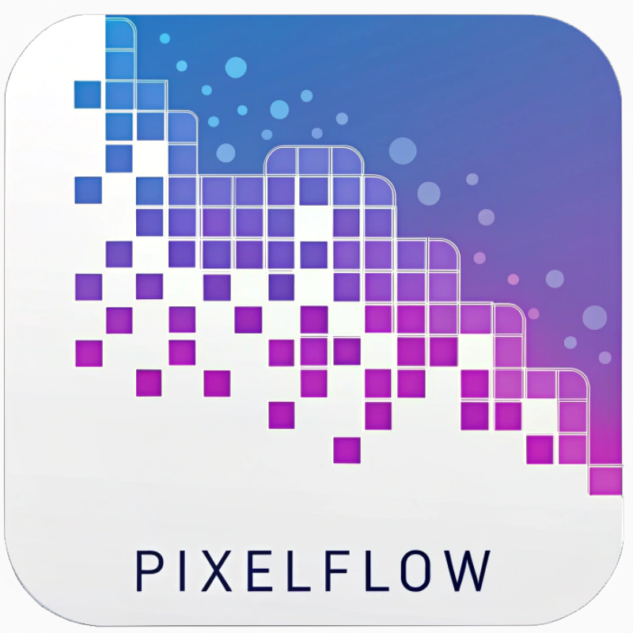

# PixelFlow



PixelFlow is a desktop application for AI image generation that provides a user-friendly interface to create customized images through text prompts. Built with Electron and React, it offers a streamlined workflow for digital artists, designers, and content creators.

## Features

- **Text-to-Image Generation**: Create images from detailed text descriptions
- **Customizable Generation Parameters**:
  - Aspect Ratio: Choose from various preset ratios (1:1, 16:9, 3:2, etc.)
  - Output Count: Generate multiple variations in a single operation
  - Inference Steps: Adjust the number of denoising steps for quality control
  - Seed Management: Set specific seeds for reproducible results
  - Output Format: Save as WebP, JPG, or PNG
  - Quality Settings: Control the output quality (0-100)
  - Resolution Control: Generate at different megapixel settings
- **Dark/Light Mode**: Toggle between themes for comfortable viewing
- **Generation History**: View previously generated images
- **Image Actions**: Download, view, and open images in external applications
- **Performance Optimization**: "Go Fast" option for quicker generation
- **Safety Controls**: Optional safety checker for content filtering

## Installation

### Prerequisites
- Node.js (v14 or higher)
- npm (v6 or higher)

### Setup

1. Clone the repository:
```
git clone https://github.com/yourusername/pixelflow.git
cd pixelflow
```

2. Install dependencies:
```
npm install
```

3. Start the development server:
```
npm run dev
```

### Building for Production

Build for your specific platform:

```
# Windows
npm run build:win

# macOS
npm run build:mac

# Linux
npm run build:linux
```

## API Keys

PixelFlow requires the following API keys:

- **Replicate API Key**: Needed for image generation functionality
  - Get your key at [replicate.com](https://replicate.com/account/api-tokens)

- **Google Gemini API Key**: Used for text processing (optional)
  - Get your key at [Google AI Studio](https://aistudio.google.com/app/apikey)

Add these keys in the application's Settings panel before using the generation features.

## Usage Guide

1. **Enter a Prompt**: Describe the image you want to generate
2. **Adjust Parameters**: Set your desired aspect ratio, quality, and other settings
3. **Generate**: Click the Generate button to create your image
4. **View Results**: Review the generated images in the display panel
5. **Save or Export**: Download or open images as needed

## Development

### Project Structure

```
pixelflow/
├── build/               # Build configuration files
├── resources/           # Application resources
├── src/
│   ├── main/            # Electron main process
│   ├── preload/         # Preload scripts
│   └── renderer/        # React application
│       ├── src/
│       │   ├── assets/  # Static assets
│       │   ├── components/ # React components
│       │   ├── App.jsx  # Main application component
│       │   └── main.jsx # Entry point
│       └── index.html   # HTML template
└── package.json         # Project dependencies
```

### Technologies Used

- **Frontend**: React, Tailwind CSS
- **Desktop Framework**: Electron
- **Backend**: Node.js
- **Image Generation**: Replicate API
- **Text Processing**: Google Gemini API (optional)

## Contributing

1. Fork the repository
2. Create a feature branch (`git checkout -b feature/amazing-feature`)
3. Commit your changes (`git commit -m 'Add some amazing feature'`)
4. Push to the branch (`git push origin feature/amazing-feature`)
5. Open a Pull Request

## License

This project is licensed under the MIT License - see the LICENSE file for details.

## Acknowledgments

- [Electron](https://www.electronjs.org/)
- [React](https://reactjs.org/)
- [Tailwind CSS](https://tailwindcss.com/)
- [Replicate](https://replicate.com/)
- [Lucide Icons](https://lucide.dev/)

---

Made with ❤️ by [Fayaz K](https://fayazk.com)
